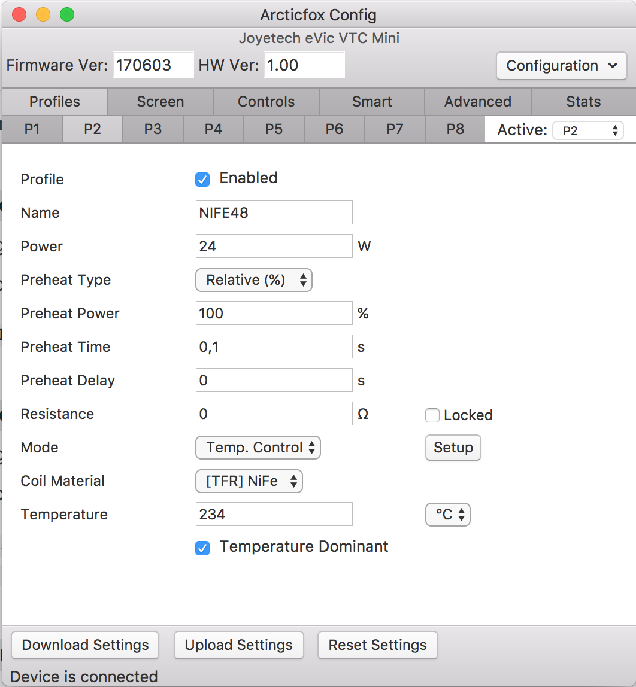
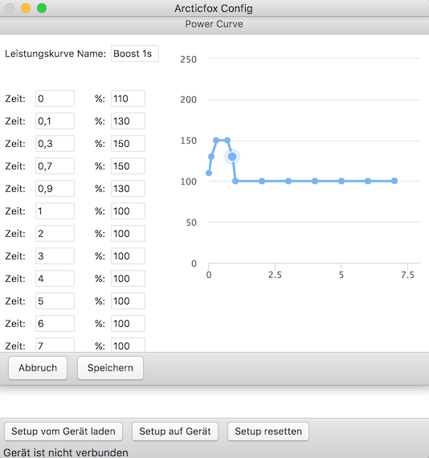

# arcticfox-config

> Configuration Tool for Vape Battery Mods with Arcticfox Firmware. Works on MacOS and Linux.

### Download

#### macOS

Go to the [latest release page](https://github.com/hobbyquaker/arcticfox-config/releases/latest) and download the 
arcticfox-config-x.x.x.dmg file.

#### Linux

~~On the [latest release page](https://github.com/hobbyquaker/arcticfox-config/releases/latest) you can find a .deb file 
for Ubuntu and Debian and a .tar.gz that should work on other distributions.~~

Until now there is now ready to use Linux build available for download. But you can build it yourself, for instructions
see https://github.com/hobbyquaker/arcticfox-config/issues/23

For USB access with an unprivileged user you need UDEV rules, see 
https://github.com/hobbyquaker/arcticfox-config/issues/25

### Usage

Start the Application, connect your Arcticfox Device.

### Contributing

Clone the repo, do `npm install` in the project root. Use `npm start` to start the application in debug mode.
Depending on your installed Node.js version it might be necessary to rebuild the USB HID module:
`./node_modules/.bin/electron-rebuild`

### Related

* https://github.com/hobbyquaker/arcticfox-monitor - A device monitoring tool for vape battery mods with Arcticfox firmware. Works on macOS and Linux.
* https://github.com/hobbyquaker/arcticfox - a Node module that abstracts the HID communication with the Arcticfox 
firmware and is also used by this project.
* https://github.com/hobbyquaker/dna-monitor - a macOS and Linux device config for battery mods with the DNA chipset.

### Credits

Based on the work of [NFE Team](https://nfeteam.org/)

* https://github.com/maelstrom2001/ArcticFox
* https://github.com/TBXin/NFirmwareEditor

This software uses [Highcharts](http://www.highcharts.com/) which is free __only for non-commercial use__.

### License

GPLv3

Copyright (c) Sebastian Raff
